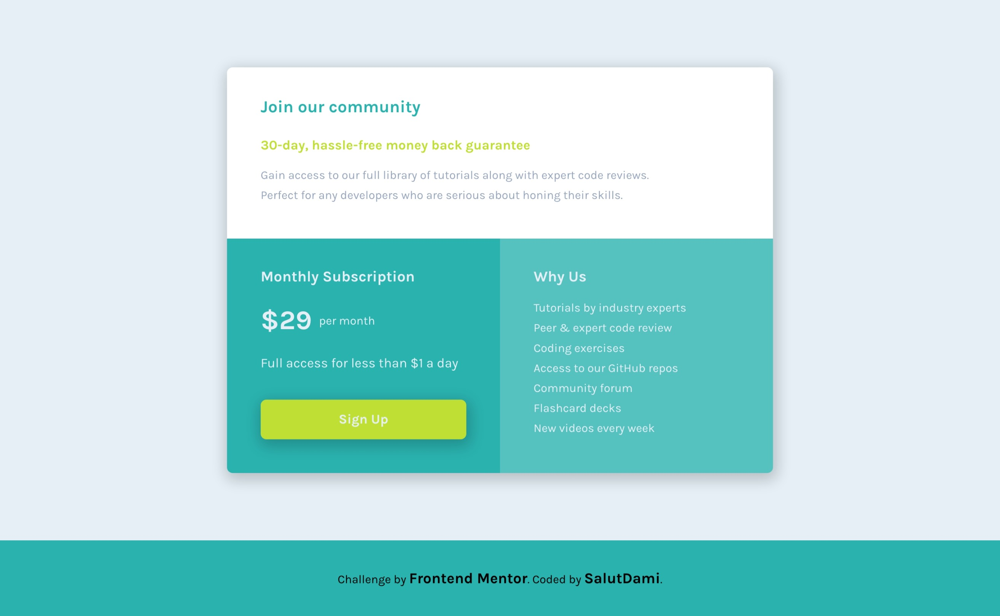
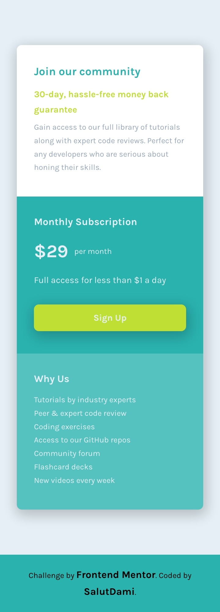

# Frontend Mentor - Single price grid component solution

This is a solution to the [Single price grid component challenge on Frontend Mentor](https://www.frontendmentor.io/challenges/single-price-grid-component-5ce41129d0ff452fec5abbbc). Frontend Mentor challenges help you improve your coding skills by building realistic projects.

## Table of contents

- [Overview](#overview)
  - [The challenge](#the-challenge)
  - [Screenshot](#screenshot)
  - [Links](#links)
- [My process](#my-process)
  - [Built with](#built-with)
  - [What I learned](#what-i-learned)
  - [Continued development](#continued-development)
  - [Useful resources](#useful-resources)

## Overview

### The challenge

The users will be able to:

- View the optimal layout for the component depending on their device's screen size
- See a hover state on desktop for the Sign Up call-to-action

### Screenshot

_A desktop view of the pricing component_

_A mobile view of the pricing component_

### Links

- Solution URL: [Add solution URL here](https://github.com/salutDami/Single-Price-Component-)
- Live Site URL: [Add live site URL here](https://salutdami.github.io/Single-Price-Component-/)

## My process

### Built with

- Semantic HTML5 markup
- CSS custom properties
- Flexbox
- CSS Grid
- Mobile-first workflow

### What I learned

My use of grid and flex-box seems to be getting much better after several practice.

### Continued development

I would keep on doing more projects to get better at my CSS as well as using the proper HTML syntax when structuring my code.

### Useful resources

- [cssgenerator.org](https://cssgenerator.org/box-shadow-css-generator.html) - This was a useful css generator I used to get the box shadow which was used for this project. I would recommmend this if you need a goood css genrator to save you some time.

## Author

- Twitter - [@\_salutDami](https://www.twitter.com/_salutDami)
- Linkedin- [Ikuomola Stephen](https://www.linkedin.com/in/ikuomola-stephen/)
- Frontend Mentor - [@salutDami](https://www.frontendmentor.io/profile/salutDami)
